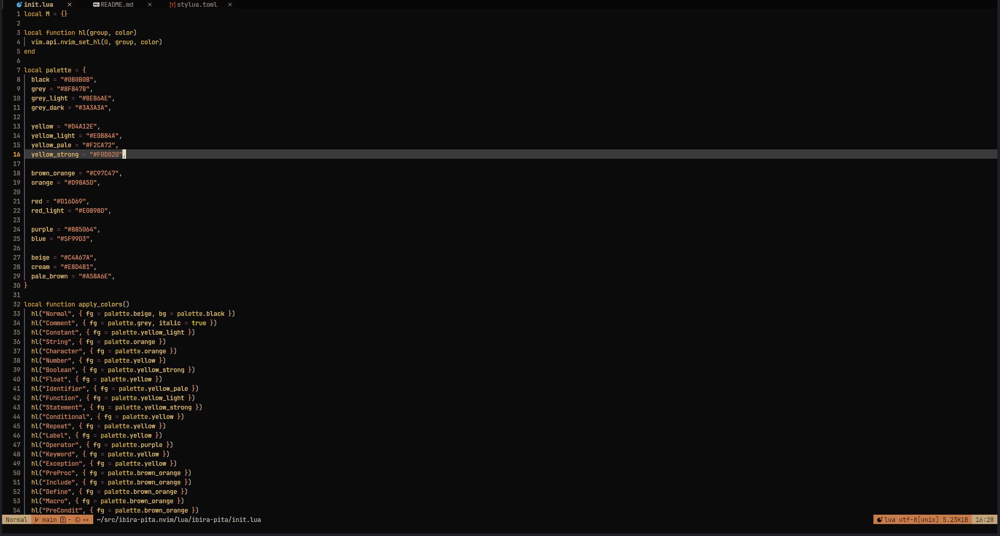

# Ibirá-Pitá

Yet another colorscheme for Neovim, with a dark background and yellow as the predominant color.

## Installation

Using a plugin manager, such as `lazy.nvim`, add the following line to your
`init.lua` file:

```lua
  {
    'rufex/ibira-pita.nvim',
    priority = 1000,
    init = function()
      vim.cmd.colorscheme 'ibira-pita'
    end,
  },
```

## Screenshots



## TODO

- [ ] Generate terminal colors with [termcolors.nvim](https://github.com/psliwka/termcolors.nvim)

## Acknowledgements

- [Vim colors](https://vimcolors.org/)
- [Termcolors](https://github.com/psliwka/termcolors.nvim)
- [Awesome Vim Colorschemes](https://github.com/rafi/awesome-vim-colorschemes)
- [Kanagawa](https://github.com/rebelot/kanagawa.nvim)

## [Peltophorum dubium](https://en.wikipedia.org/wiki/Peltophorum_dubium)


[Image by Tatters ❀ from Brisbane, Australia - Peltophorum dubium, CC BY-SA 2.0](https://commons.wikimedia.org/w/index.php?curid=32552185)
